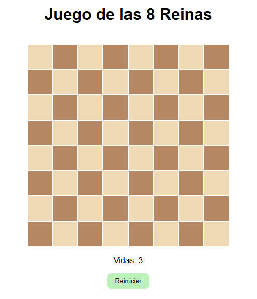

# Juego de las 8 Reinas

El objetivo del juego es colocar 8 reinas en un tablero de ajedrez de 8x8 de manera que ninguna reina pueda atacar a otra. Puedes colocar una reina haciendo clic en una celda vacía. Si haces clic en una reina, la quitarás del tablero. Si intentas colocar una reina en una posición donde pueda ser atacada, perderás una vida. Tienes 3 vidas. ¡Buena suerte!

## Cómo jugar

1. **Colocar una reina**: Haz clic en una celda vacía para colocar una reina.
2. **Quitar una reina**: Haz clic en una reina para quitarla del tablero.
3. **Perder una vida**: Si intentas colocar una reina en una posición donde pueda ser atacada, perderás una vida y aparecerá una "X" roja en la celda durante un segundo.
4. **Ganar el juego**: Coloca las 8 reinas en el tablero sin que ninguna pueda atacar a otra.
5. **Perder el juego**: Si pierdes las 3 vidas, el juego terminará y tendrás que reiniciar.

## Controles

- **Clic en una celda vacía**: Coloca una reina.
- **Clic en una reina**: Quita la reina del tablero.
- **Botón "Reiniciar"**: Reinicia el juego.

## Requisitos

- Un navegador web moderno (Chrome, Firefox, Safari, Edge).

## Instalación

1. Clona este repositorio o descarga los archivos.
2. Abre el archivo `index.html` en tu navegador web.

## Estructura del proyecto

- `index.html`: Contiene la estructura HTML del juego.
- `styles.css`: Contiene los estilos CSS para el diseño del juego.
- `script.js`: Contiene la lógica del juego en JavaScript.

## Capturas de pantalla

## Créditos

Desarrollado por Aintzane Goffard.

## Licencia

Este proyecto está licenciado bajo la Licencia MIT. Consulta el archivo `LICENSE` para obtener más detalles.
